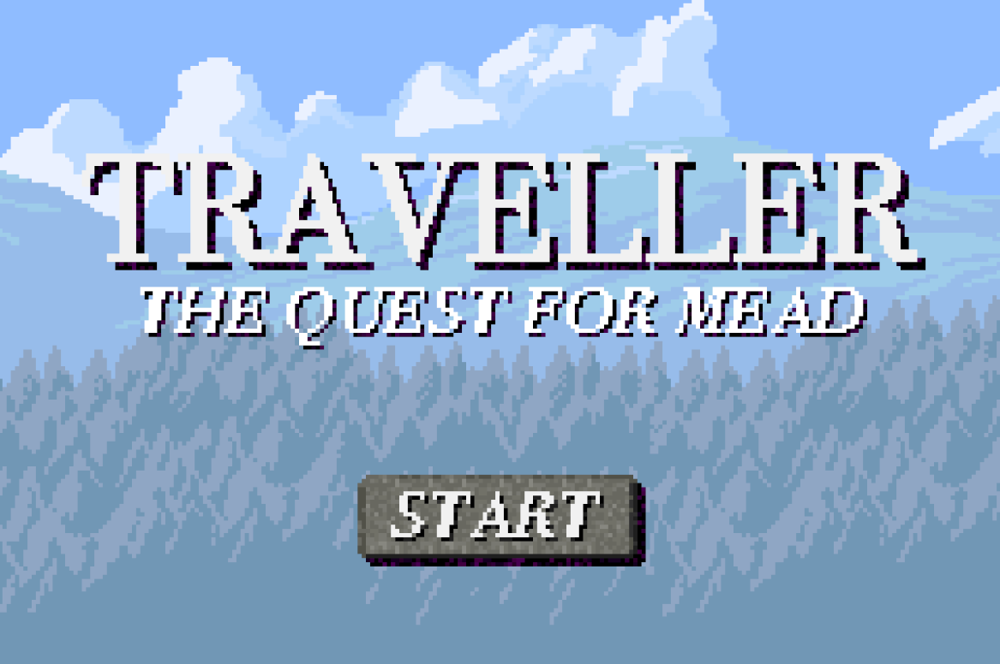
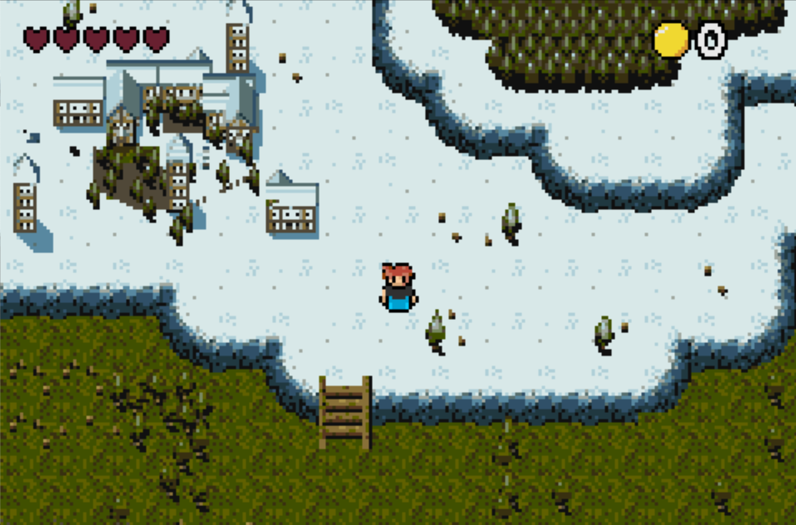
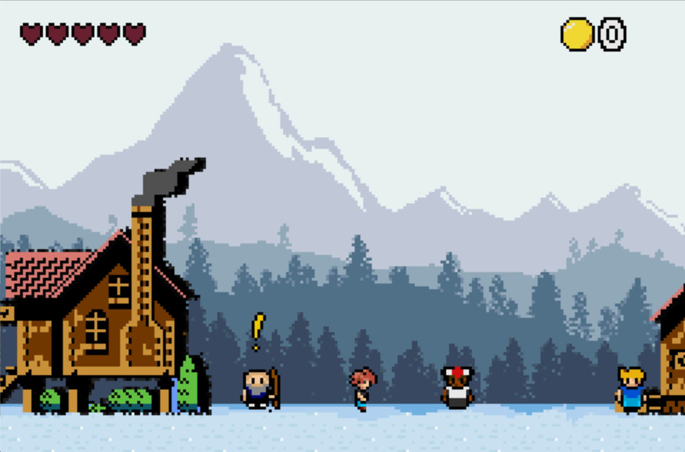
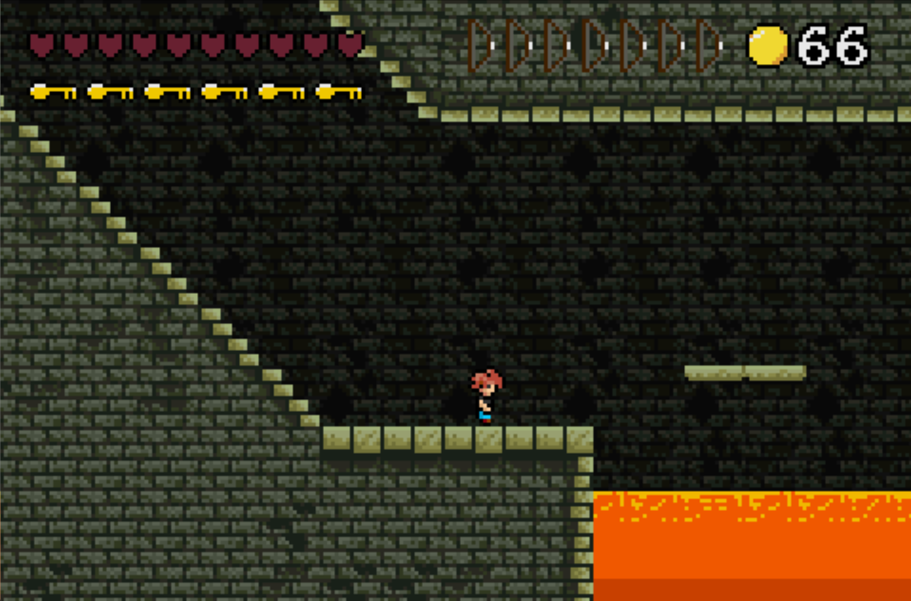
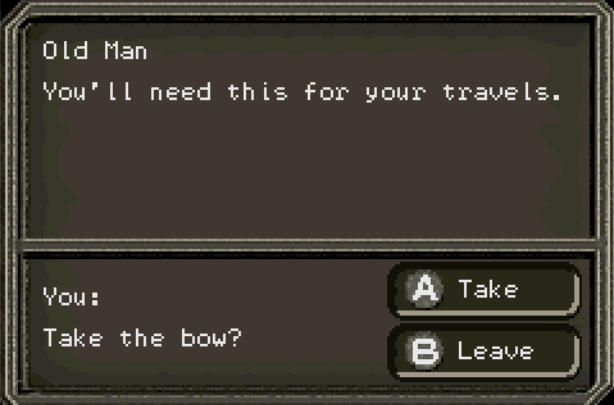

# Traveller - The Quest For Mead

*Final Project for CS 2261*

*By: Nathan Davenport*

**Welcome to my game!**

## Requirements
- A Gameboy Advance remulator is required
- Visualboy Advacne is reccomend on the desktop, foudn on Windows, MacOS, and Linux distros: [https://vba-m.com](https://vba-m.com)

## Objectives:
- Multiple quests to complete across the map.
- Once the player earns three keys, they may enter the dungeon and beat the final boss.
- Traveling around the map causes random encounters and opportunities to make money.
- The player is able to upgrade their bow several times with this money, making the game much easier over time.
- Player can also heal with money earned.

## Controls (world): 
- left/right/up/down to move on world map

## Controls (town):
- left/right to move
- up to jump!
- b to shoot arrows
- a to interact
- select to go back to map view

## Controls (global):
- start to pause and unpause game
- start to start and restart game from start and win/lose screens
- select from the pause screen to reset the game
- a and b on the text screens to answer prompts

## Cheat:
- Towards bottom of the map, next to the snow mountain hill in the little crevice, the player can press A all the way against the wall and activate gruelsome mode.
- Gruelsome mode converts all the villages to be hostile to the player, an the player can basically go murder everyone in the towns for money. 
- The game is still able to be won in the dungeon, but the player is super charged so the game becomes ridiculously easy.

## Gameplay Pictures

## Enjoy!! ##
